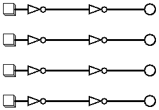
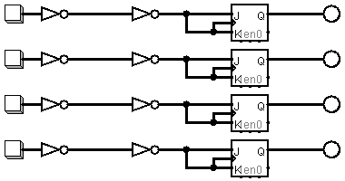
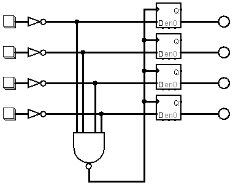
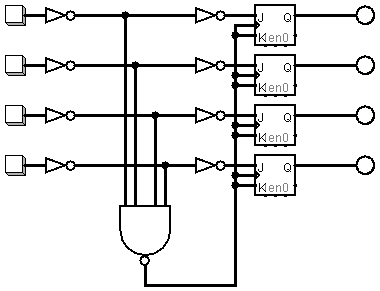

# SwitchBanks
Part of the **[xp-circuit-blocks](https://github.com/gom9000/xp-circuit-blocks)** collection: practical notes about reusable circuit building blocks.

**Background**:
A structured classification and implementation of switch-bank interface circuits.  
In instrument interfaces and control panels, managing multiple switch inputs often requires specific logic behaviors, such as latching the state of the last pressed switch, displaying status on a LED array, or handling simultaneous presses. This eXPerience explores the behaviour models of switch-banks and their practical implementation using discrete logic gates, passive RC debouncing networks, and microcontrollers.

This eXPerience focuses exclusively on **momentary switches**, where the contact status is maintained only while the actuating force is applied (i.e., while the switch is actively depressed).

All schematics, simulations, and PCB layouts are designed using **ExpressPCB**, **LTspice**, and **Logisim**.

## Switch-Banks Classification
A **switch-bank** is a collection of related switches that together implement a specific interaction model. They may be physically arranged as an array or matrix, depending on the application.  
The operational behavior of a switch-bank is defined by two fundamental axes: the **Relationship Type** between individual switches and their **Action Mode**.

### Relationship Types
Defines how multiple switch presses interact within the same bank:

* **Mutually-Inclusive ($i$):** More than one switch can be active simultaneously.
* **Mutually-Exclusive ($x$):** Only one switch can be active at any given time (pressing a switch invalidates or overrides others).

### Action Modes
Defines the output state retention after releasing the physical switch:

* **Momentary ($mo$):** The output state is active only while the switch is actively depressed.
* **Maintained ($ma$):** The output state persists after releasing the switch, holding the last state until a new event occurs.
* **Alternated ($al$):** A maintained switch-bank where successive depress/release actions on the *same* switch toggle its individual state between active and inactive.

## Operational Behaviours
The combination of relationship types and action modes, determines the following **operational behaviours**:

| Behaviour | Relationship | Action | Typical Analogy / Application |
| :--- | :---: | :---: | :--- |
| **Momentary Mutually-Inclusive** | Inclusive ($i$) | Momentary ($mo$) | Polyphonic keyboard / Raw switch array |
| **Alternated Mutually-Inclusive** | Inclusive ($i$) | Alternated ($al$) | Independent toggle-button panel |
| **Momentary Mutually-Exclusive** | Exclusive ($x$) | Momentary ($mo$) | Monophonic keyboard (last-note / priority) |
| **Maintained Mutually-Exclusive** | Exclusive ($x$) | Maintained ($ma$) | Channel Selector / Radio-button bank |
| **Alternated Mutually-Exclusive** | Exclusive ($x$) | Alternated ($al$) | Single-active toggle with global clear |

### Implementation Diagrams

#### Momentary Mutually-Inclusive Switch-Bank
*(Polyphonic Keyboard / Independent Momentary Lines)*
> 

#### Alternated Mutually-Inclusive Switch-Bank
*(Toggle-Button Bank / Independent Toggles)*
> 

#### Momentary Mutually-Exclusive Switch-Bank
*(Monophonic Keyboard / Direct Priority Routing)*
> 

#### Maintained Mutually-Exclusive Switch-Bank (Selector)
*(Radio-Button Selector with Latch / Channel Selector)*
> 

#### Alternated Mutually-Exclusive Switch-Bank
*(Radio-Button with Toggle-to-Clear Capability)*
> 

## Hardware Architectures
This experience explores different implementation approaches for these operational behaviours. The same model can be implemented using different hardware architectures.

- **Pure Hardware Logic (TTL / RC Debounce + Hardware Registers):**
   * Uses asymmetric RC networks paired with Schmitt-trigger gates for debouncing, and registers for latching.
   * **Characteristics:** Deterministic propagation delay, long-term operational autonomy, and self-documenting schematics.

- **Interface-Based Logic (MCU + Hardware Registers):**
   * Uses a microcontroller to handle debouncing and routing via firmware, while driving standard hardware registers for output holding and LED driving.
   * **Characteristics:** Simplifies input processing logic components and pcb routing, at the cost of software state management.

- **Full MCU Logic:**
   * Uses a microcontroller to handle every aspect of the switch-bank: reading inputs, debouncing via software, managing internal state logic, and directly driving outputs or LED arrays via GPIO pins.
   * **Characteristics:** Minimizes component count and simplifies pcb routing, at the cost of software state management and direct I/O pin allocation.

>***Note on long-term maintainability**: Pure Hardware implementations are fully self-contained artifacts: the schematic is the complete specification, reproducible indefinitely using standard component families. MCU-based approaches introduce an external dependency on toolchains, programmers, and firmware source availability, which historically have shown a much shorter lifecycle than the hardware itself.*

### Reference Implementations
The following projects provide practical implementations of the models described above.

* **[Hardware SwitchBank Selector 4](switchbank-selector-4.md)**
  Discrete 4-channel implementation using asymmetric RC debouncing, 74LS132 Schmitt triggers, and 74LS175 Quad D-Flip-Flop latching.
* **[Hardware SwitchBank 8](switchbank-8.md)**
  Discrete 8-channel implementation using asymmetric RC debouncing, 74LS132 Schmitt triggers, and 74LS574 octal register latching.
* **[Interface-Based SwitchBank 8](switchbank-pic-8.md)**
  Hybrid 8-channel implementation using a PIC16F648A for debouncing and mode routing, driving a 74LS574 octal register.
