# TO-220 Heatsink Thermal Resistance
Part of the **[hardware eXPerience](https://github.com/gom9000/xp-hardware)** collection: reusable engineering knowledge built through practical experimentation.

**Background**:  
When designing custom power stages, analog drivers, or linear regulators, surplus or unbranded TO-220 heatsinks are often available in quantity. However, these parts lack datasheets specifying their thermal resistance to ambient ($R_{th,sa}$). Relying on rough visual estimates introduces thermal risk or leads to over-engineering.  
These notes define a repeatable, bench-tested experimental procedure to characterize unknown TO-220 heatsinks by determining their thermal resistance ($\Theta_{sa}$), using a controlled power dissipation rig under natural convection.

## Thermal Model
Heat transfer in steady state can be represented using a thermal-resistance model. Because its mathematical structure is identical to Ohm's law, heat flow through a medium can be modeled using an equivalent electrical circuit, where the temperature difference between any two nodes $A$ and $B$ is equivalent to voltage drop, and heat flow to current:

$$\Delta T_{A-B} = P_D \cdot \Theta_{A-B}$$

Applying this model to a power transistor mounted on a heatsink gives:

$$\Delta T_{j-a} = T_j - T_a = P_D \cdot \Theta_{ja} = P_D \cdot (\Theta_{jc} + \Theta_{cs} + \Theta_{sa})$$

Where:
* $T_j$: Transistor junction temperature ($^{\circ}\text{C}$)
* $T_c$: Transistor case temperature ($^{\circ}\text{C}$)
* $T_s$: Heatsink surface temperature near the TO-220 tab ($^{\circ}\text{C}$)
* $T_a$: Ambient air temperature ($^{\circ}\text{C}$)
* $P_D$: Total power dissipated as heat ($\text{W}$)
* $\Theta_{ja}$: Thermal resistance from junction to ambient ($^{\circ}\text{C}/\text{W}$)
* $\Theta_{jc}$: Thermal resistance from junction to case ($^{\circ}\text{C}/\text{W}$)
* $\Theta_{cs}$: Thermal resistance from case to heatsink ($^{\circ}\text{C}/\text{W}$)
* $\Theta_{sa}$: Thermal resistance from heatsink to ambient ($^{\circ}\text{C}/\text{W}$)

Since the thermal circuit consists of series components, the temperature drop across any sub-section equals the heat flow $P_D$ multiplied by the thermal resistance of that specific segment. Therefore, evaluating the network strictly between the heatsink surface ($T_s$) and ambient ($T_a$) gives:

$$T_s - T_a = P_D \cdot \Theta_{sa}$$

By directly measuring the steady-state temperature at the heatsink mounting surface ($T_s$) adjacent to the TO-220 tab, $\Theta_{jc}$ and $\Theta_{cs}$ drop out of the heatsink evaluation:

$$\Theta_{sa} = \frac{T_s - T_a}{P_D}$$

### Reference Values for TO-220
* **TO-220 Free Air ($\Theta_{ja}$ without heatsink):** $\sim 60 \div 65\,^{\circ}\text{C/W}$
* **TO-220 Junction-to-Case ($\Theta_{jc}$):** $\sim 1.0 \div 3.0\,^{\circ}\text{C/W}$ (check component datasheet)
* **Thermal Interface Material ($\Theta_{cs}$):**
    * Direct contact with thermal grease: $\sim 0.2 \div 0.5\,^{\circ}\text{C/W}$
    * Mica washer + thermal grease: $\sim 0.5 \div 1.2\,^{\circ}\text{C/W}$
    * Silicone pad: $\sim 1.5 \div 3.0\,^{\circ}\text{C/W}$

## Test Setup
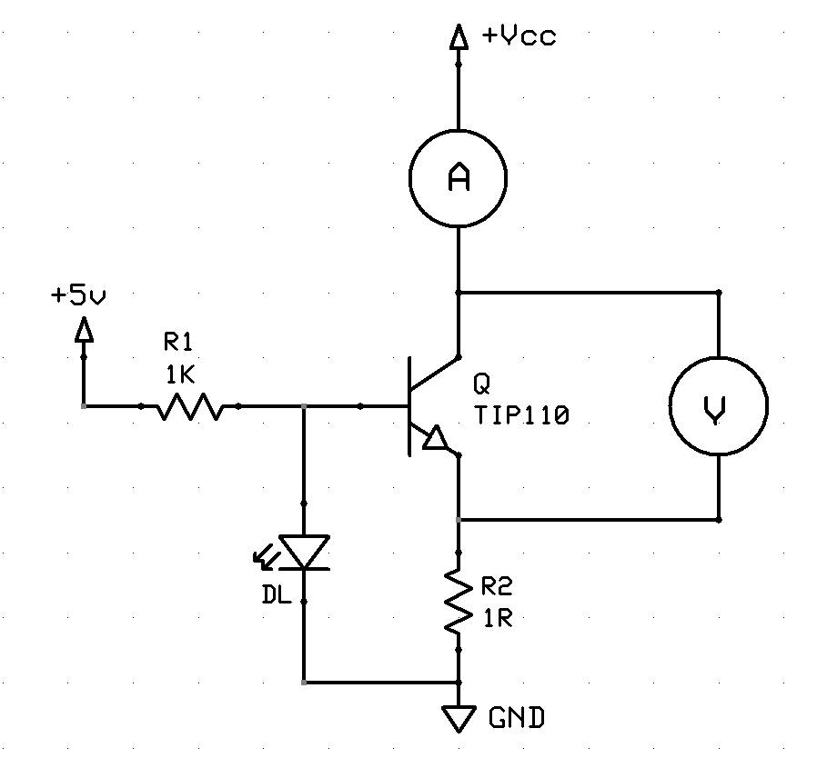

## Test Procedure (Target Temperature Method)
This procedure fixes the target steady-state temperature $T_s^{\text{*}}$ and measures the electrical power $P_D$ required to sustain it.  
The test utilizes a **TIP110 NPN Darlington transistor** ($h_{FE} \ge 1000$). The base current, and consequently the base power dissipation, is negligible compared with the collector-emitter dissipation. Therefore, total transistor dissipation is approximated as $P_D \approx V_{CE} \cdot I_C$.

1. **Target Temperature Selection**:
   Select a safe target temperature above ambient, as:
   $$T_s^{\text{*}} = 60.0\,^{\circ}\text{C} \quad (\Delta T \approx 30 \div 40\,^{\circ}\text{C} \text{ above typical } T_a)$$

2. **Operating Point Adjustment**:
   * Power up the bench supply driving the test transistor $Q$.
   * Gradually increase $V_{CE}$ until the surface sensor approaches $T_s^{\text{*}}$.
   * Wait for thermal equilibrium ($\frac{dT_s}{dt} < 0.1\,^{\circ}\text{C/min}$).
   * Fine-tune the $V_{CE}$ to lock $T_s$ at the target temperature $T_s^{\text{*}}$.

3. **Data Acquisition**:
   * Measure $V_{CE}$ and $I_C$ at equilibrium.
   * Calculate absorbed power: $P_D \approx V_{CE} \cdot I_C$.
   * Measure ambient temperature $T_a$.

4. **Calculation**:
   $$\Theta_{sa} = \frac{T_s^{\text{*}} - T_a}{P_D}$$

**Notes:**  
    - All measurements were performed with the heatsink oriented vertically.  
    - Since $V_{CE}$ is manually adjusted to lock onto the target temperature ($T_s^* = 60\,^{\circ}\text{C}$), each measurement is already the result of an equilibrium convergence rather than a single instantaneous snapshot. Repeating multiple test runs offers negligible statistical benefit.

## Test Log
The circuit was tested using a **GVDA 30V/10A** switching laboratory power supply. Heatsink temperature was measured using a **GVDA GD128** multimeter, transistor $V_{CE}$ was measured with **FNIRSI 1014D** oscilloscope, and transistor $I_C$ was measured using a **MITEK MK6322** multimeter. Tests were conducted under natural convection with an ambient temperature of $31\ ^\circ\text{C}$.

* **Instrument Accuracy Ratings:**
    * **Temperature ($T_s, T_a$):** GVDA GD128 + Type-K Probe: $\pm(1.0\% + 2.0\,^{\circ}\text{C})$
    * **Voltage ($V_{CE}$):** FNIRSI 1014D Scope: $\pm(3.0\% + 2\text{ digits})$
    * **Current ($I_C$):** MITEK MK6322 DMM (10A Range): $\pm(1.2\% + 3\text{ digits})$

* **Measurement Error Propagation:**
    * **Thermal Gradient ($\Delta T = 29.0\,^{\circ}\text{C}$):** Since $T_s$ and $T_a$ are measured using the same instrument setup, the systematic offset ($\pm 2.0\,^{\circ}\text{C}$) cancels out. Accounting for gain error ($1.0\%$) and integer display resolution ($\pm 0.5\,^{\circ}\text{C}$ per reading):
    $u(\Delta T) = \sqrt{(29.0 \cdot 0.01)^2 + 0.5^2 + 0.5^2} = \pm 0.77\,^{\circ}\text{C} \quad (\approx \pm 2.65\%)$
    * **Power Dissipation ($P_D = V_{CE} \cdot I_C$):** $\frac{u(P_D)}{P_D} = \sqrt{\left(\frac{u(V_{CE})}{V_{CE}}\right)^2 + \left(\frac{u(I_C)}{I_C}\right)^2}$
    * **Combined Uncertainty ($\Theta_{sa}$):** $\frac{u(\Theta_{sa})}{\Theta_{sa}} = \sqrt{\left(\frac{u(\Delta T)}{\Delta T}\right)^2 + \left(\frac{u(P_D)}{P_D}\right)^2}$

| ID / Geometry | Dimensions (WxDxH) [mm] | Weight [g] | Finish | $V_{CE}$ [V] | $I_C$ [A] | $P_D$ [W] | $T_a$ [$^{\circ}\text{C}$] | $T_s^*$ [$^{\circ}\text{C}$] | $\Theta_{sa}$ [$^{\circ}\text{C}/\text{W}$] | $u(\Theta_{sa})$ [$^{\circ}\text{C}/\text{W}$] |
| :--- | :---: | :---: | :---: | :---: | :---: | :---: | :---: | :---: | :---: | :---: |
| **HS-01** | 15 x 10 x 22 | 2 | Silver | - | - | - | - | 60 | - | - |
| **HS-02** | 15 x 11 x 20 | 2 | Silver | 1.65 | 0.55 | 0.91 | 31 | 60 | 32.0 | $\pm 2.7$ ($\pm 8.3\%$) |
| **HS-03** | 15 x 11 x 20 | 2 | Black | 2.00 | 0.57 | 1.14 | 31 | 60 | 25.0 | $\pm 2.0$ ($\pm 8.1\%$) |
| **HS-04** | 23 x 17 x 25 | 10 | Black | 3.40 | 0.59 | 2.01 | 31 | 60 | 14.5 | $\pm 1.1$ ($\pm 7.7\%$) |
| **HS-05** | 32 x 10 x 36 | 12 | Silver/Raw | 3.41 | 0.61 | 2.08 | 31 | 60 | 14.0 | $\pm 1.1$ ($\pm 7.6\%$) |
| **HS-06** | 43 x 8 x 29 | 16 | Silver | 3.23 | 0.60 | 1.94 | 31 | 60 | 15.0 | $\pm 1.1$ ($\pm 7.7\%$) |
| **HS-07** | 28 x 13 x 33 | 15 | Black | 4.10 | 0.59 | 2.42 | 31 | 60 | 12.0 | $\pm 0.9$ ($\pm 7.7\%$) |
| **HS-08** | 23 x 17 x 25 | 18 | Black | 4.50 | 0.65 | 2.92 | 31 | 60 | 9.9 | $\pm 0.7$ ($\pm 7.3\%$) |
| **HS-09** | 30 x 19 x 33 | 28 | Nickel Plated | - | - | - | - | 60 | - | - |

### Thermal Resistance vs Weight Correlation
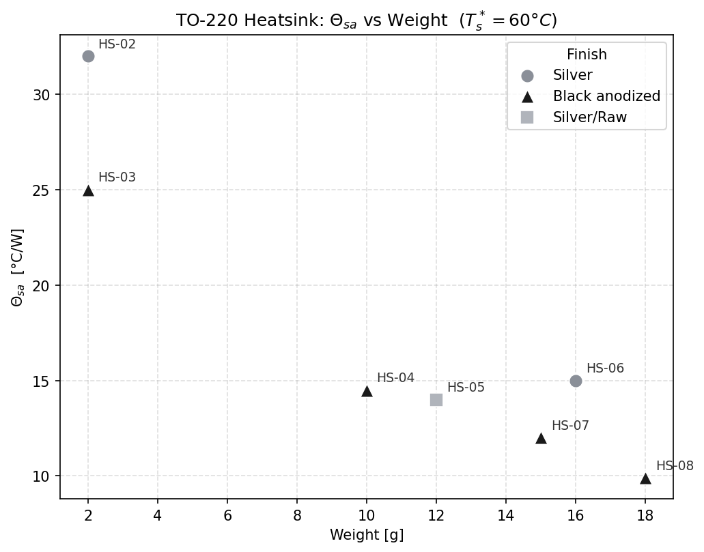

### HS Catalog
#### **HS-01** - Extruded aluminum U-channel (silver)
 

#### **HS-02** - Extruded aluminum U-channel (silver)
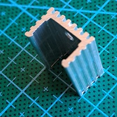 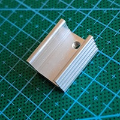

#### **HS-03** - Extruded aluminum U-channel (anodized black)
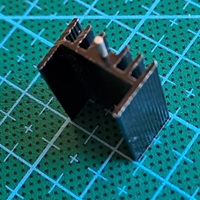 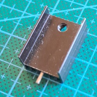

#### **HS-04** - Extruded aluminum U-channel (anodized black)
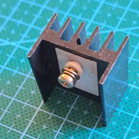 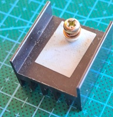

#### **HS-05** - Extruded aluminum dual-pillar channel (silver / raw finish)
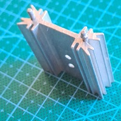 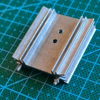

#### **HS-06** - High-density extruded aluminum plate (silver)
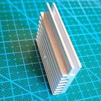 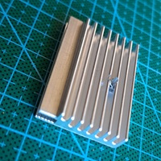

#### **HS-07** - Extruded aluminum dual-pillar channel (anodized black)
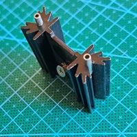 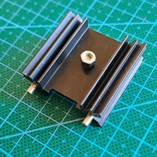

#### **HS-08** - Medium extruded aluminum U-channel (anodized black)
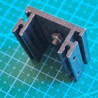 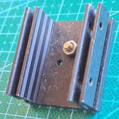

#### **HS-09** - Stamped steel clip-on (nickel/bright plated)
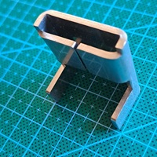 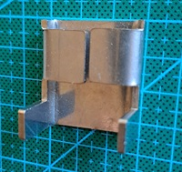
